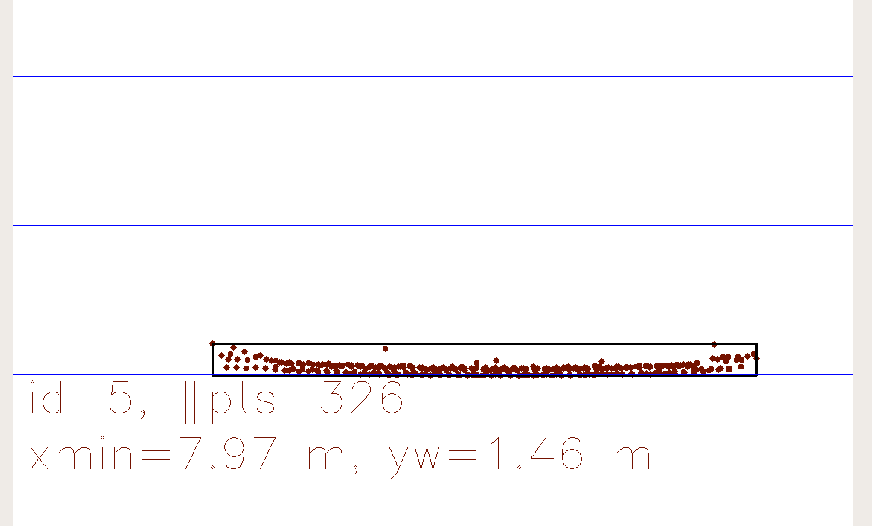
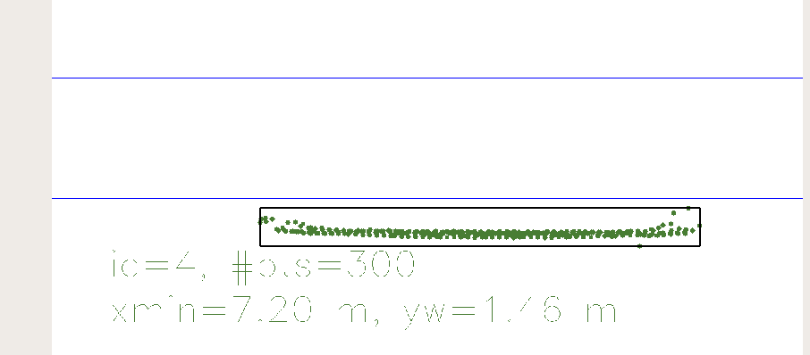
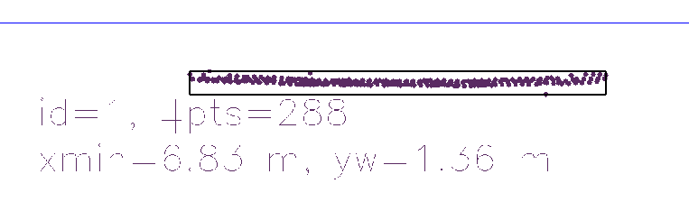
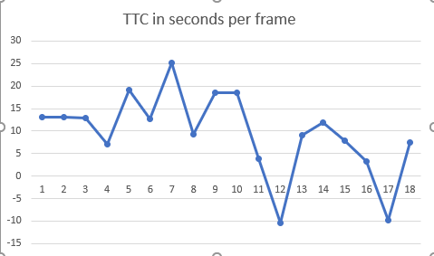
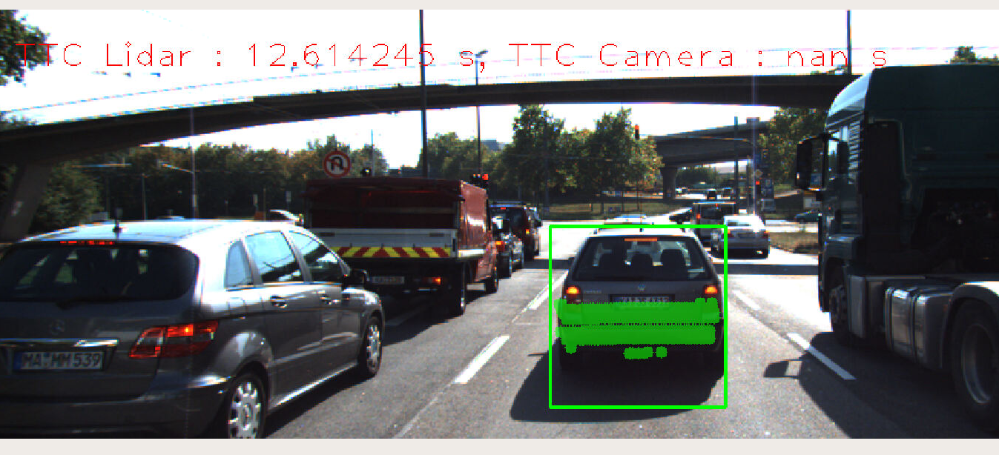
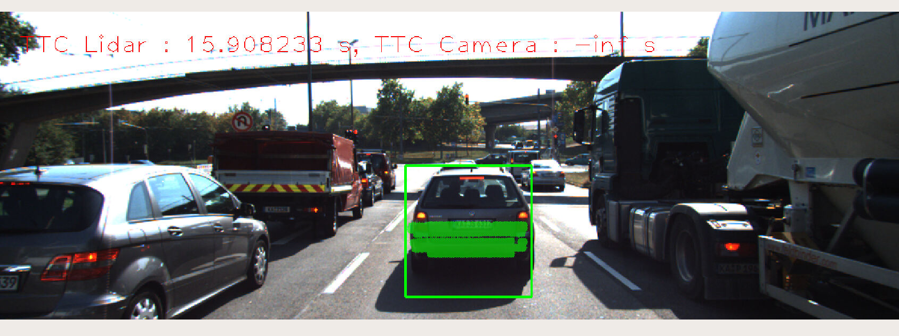

# 3D Object Tracking

## FP 1

Implementation is at line 263 in camFusion_Student.cpp file.

## FP 2

Lidar based TTC is implemented at line 229 in camFusion_Student.cpp file.

## FP 3

Implementation is at line 139 in camFusion_Student.cpp file.

## FP 4

Camera based TTC is implemented at line 178 in camFusion_Student.cpp file.

## FP 5

With the help of the 3D object representation and the frame rate a TTC can be computed prior to our software computation.

The frame rate value is 10 Hz and to compute TTC we use:
TTC = curr_min_dist / (frameRate * (prev_min_dist - curr_min_dist))

x_min frame 0: 7,97 m

x_min frame 1: 7,91 m -> TTC frame 0-1 : 13,183 s

x_min frame 2: 7,85 m -> TTC frame 1-2 : 13,083 s

x_min frame 3: 7,79 m -> TTC frame 2-3 : 12,983 s

x_min frame 4: 7,68 m -> TTC frame 3-4 : 6,982 s

x_min frame 5: 7,64 m -> TTC frame 4-5 : 19,1 s

x_min frame 6: 7,58 m -> TTC frame 5-6 : 12,63 s

x_min frame 7: 7,55 m -> TTC frame 6-7 : 25,167 s

x_min frame 8: 7,47 m -> TTC frame 7-8 : 9,337 s  

x_min frame 9: 7,43 m -> TTC frame 8-9 : 18,575 s

x_min frame 10: 7,39 m -> TTC frame 9-10 : 18,475 s

x_min frame 11: 7,20 m -> outliers in front of other points!! -> TTC frame 10-11 : 3,789 s

x_min frame 12: 7,27 m -> TTC frame 11-12 : - 10,385 s (which means the car in front is getting away)  

x_min frame 13: 7,19 m - > TTC frame 12-13 : 8,9875 s 

x_min frame 14: 7,13 m -> TTC frame 13-14 : 11,883 s    

x_min frame 15: 7,04 m -> TTC frame 14-15 : 7,822 s

x_min frame 16: 6,83 m -> outliers in front of other points!! -> TTC frame 15-16 : 3,252 s

x_min frame 17: 6,90 m -> TTC frame 18-17 : - 9,857 s (which means the car in front is getting away)

x_min frame 18: 6,81 m ->TTC frame 17-18 : 7,567 s

### Observations

Some outliers can cause a poor computation of the Lidar based TTC.

From the previous graph some insights can be extracted:

1) The Lidar TTC is noisy
2) Outliers are causing extra noise and can be avoided
3) with a lower frame rate for Lidar based TTC noise could be reduced

## FP 6: 
The camera based TTC can be off when the median distance between keypoints matches get close or equal to 1. It can happen when both cars are keeping the exact same distance or when both cars stopped. Also in some cases the keypoint detector/descriptor does not provide enough keypoints match inside the bounding box wich prevent from TTC computation and gives us a "nan" result.

Harris detector is not represented and is out of the competition for the best TTC Camera model because of the low number of keypoints on the car.

All the results of the camera TTC can be found inside the CSV file ("ttc_per_combinations.csv") in the root directory.

It is clear from the result that the quality of the TTC is dependent on the quality of the keypoints detector more than from the descriptor.

If only this project is taken into account the best combinations are:

1) SIFT-SIFT
2) SIFT-BRISK
3) SIFT-BRIEF

